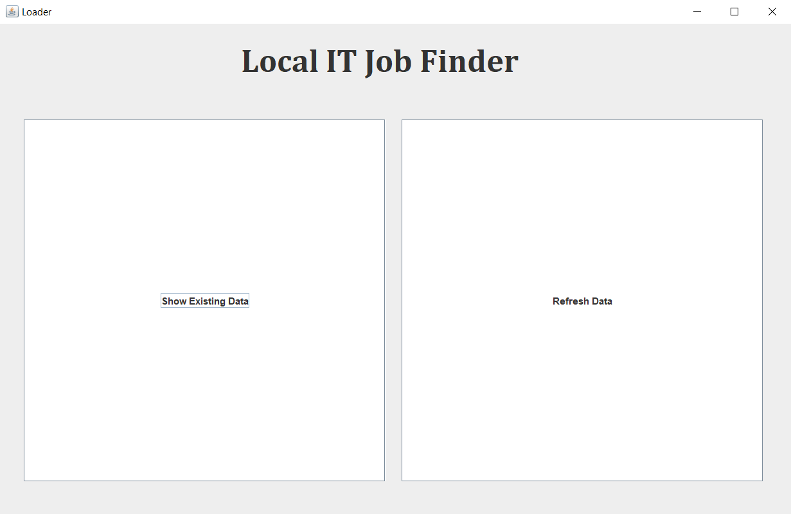

# Local IT Job Finder
## Introduction
Desktop based Web scraping & parsing application built on JavaSE to fetch IT job circulars from various Bangladeshi online job portals. It collects IT Job circulars from job portal and store them in local database and provides features to search and view according to user's need.

## Job Portals

* [CareerJet](http://www.careerjet.com.bd)
* [Job Dot Com](https://www.job.com.bd/)
* [BD Jobs](https://www.bdjobs.com/) - (Under development)


## Technologies

* JavaSE
* JSoup
* Swing
* MySQL

## Instruction

* Clone this repo: 
```
git clone https://github.com/SazzadSH/Local-IT-Job-Finder
```
* Import the MySQL DB from 'Database' folder
* Make sure handle dependecies: JDBC Driver, Java MySQL Connector, JSoup
* Build the application:
```
javac Start.java
java Start
```

## Screenshots



### Prerequisites

What things you need to install the software and how to install them

```
Give examples
```

### Installing

A step by step series of examples that tell you how to get a development env running

Say what the step will be

```
Give the example
```

And repeat

```
until finished
```

End with an example of getting some data out of the system or using it for a little demo

## Running the tests

Explain how to run the automated tests for this system

### Break down into end to end tests

Explain what these tests test and why

```
Give an example
```

### And coding style tests

Explain what these tests test and why

```
Give an example
```

## Deployment

Add additional notes about how to deploy this on a live system

## Built With

* [Dropwizard](http://www.dropwizard.io/1.0.2/docs/) - The web framework used
* [Maven](https://maven.apache.org/) - Dependency Management
* [ROME](https://rometools.github.io/rome/) - Used to generate RSS Feeds

## Contributing

Please read [CONTRIBUTING.md](https://gist.github.com/PurpleBooth/b24679402957c63ec426) for details on our code of conduct, and the process for submitting pull requests to us.

## Versioning

We use [SemVer](http://semver.org/) for versioning. For the versions available, see the [tags on this repository](https://github.com/your/project/tags). 

## Authors

* **Billie Thompson** - *Initial work* - [PurpleBooth](https://github.com/PurpleBooth)

See also the list of [contributors](https://github.com/your/project/contributors) who participated in this project.

## License

This project is licensed under the MIT License - see the [LICENSE.md](LICENSE.md) file for details

## Acknowledgments

* Hat tip to anyone whose code was used
* Inspiration
* etc

