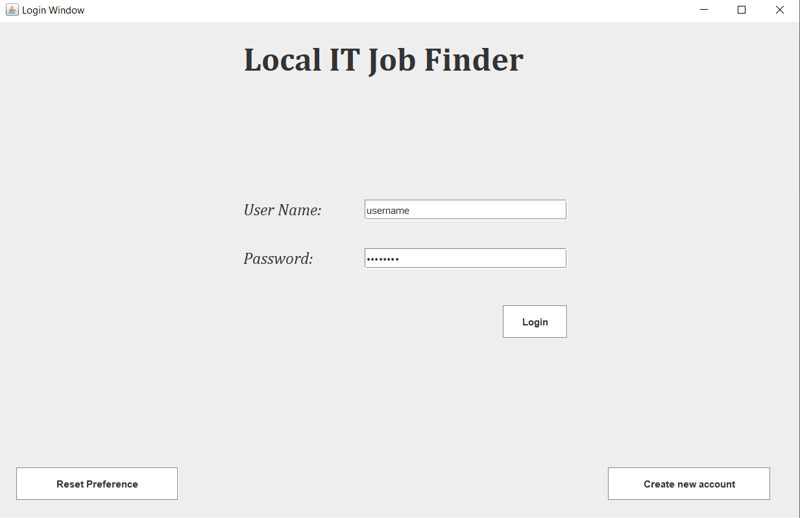
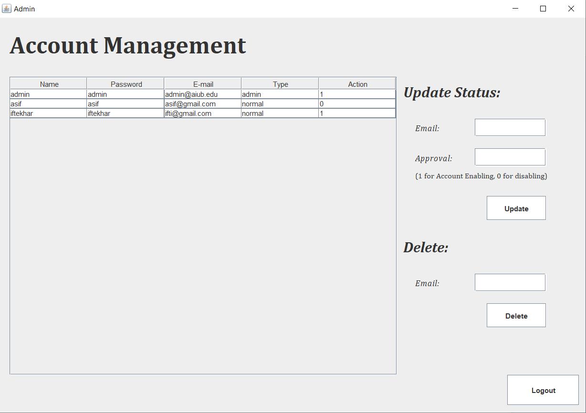
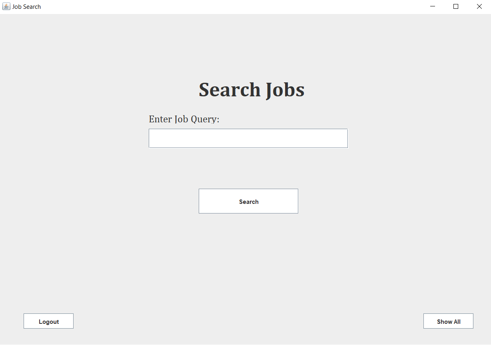
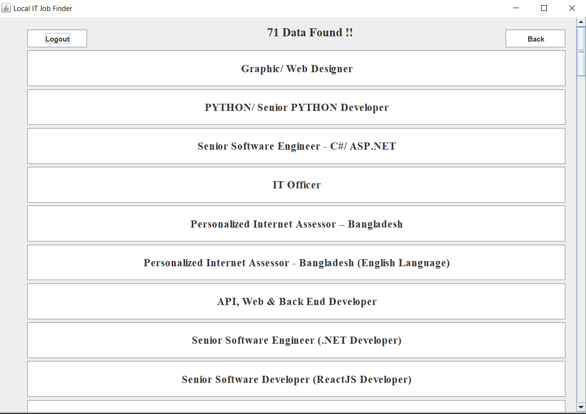
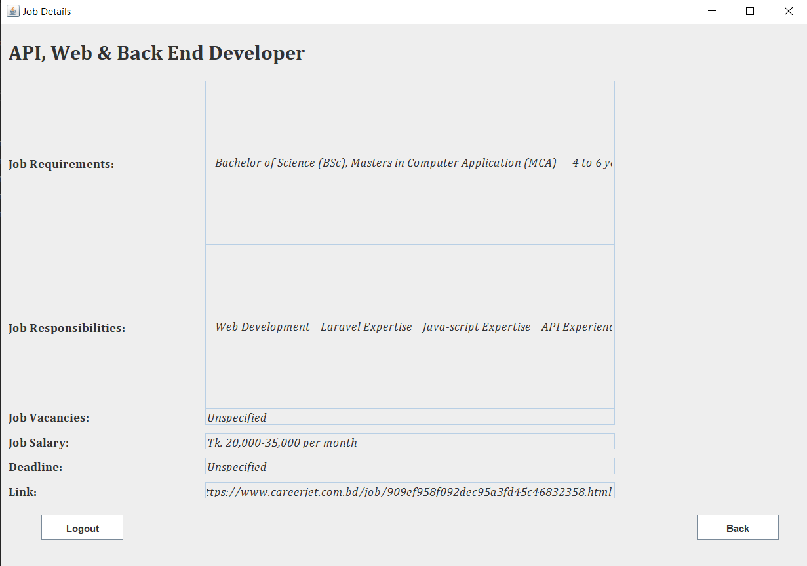
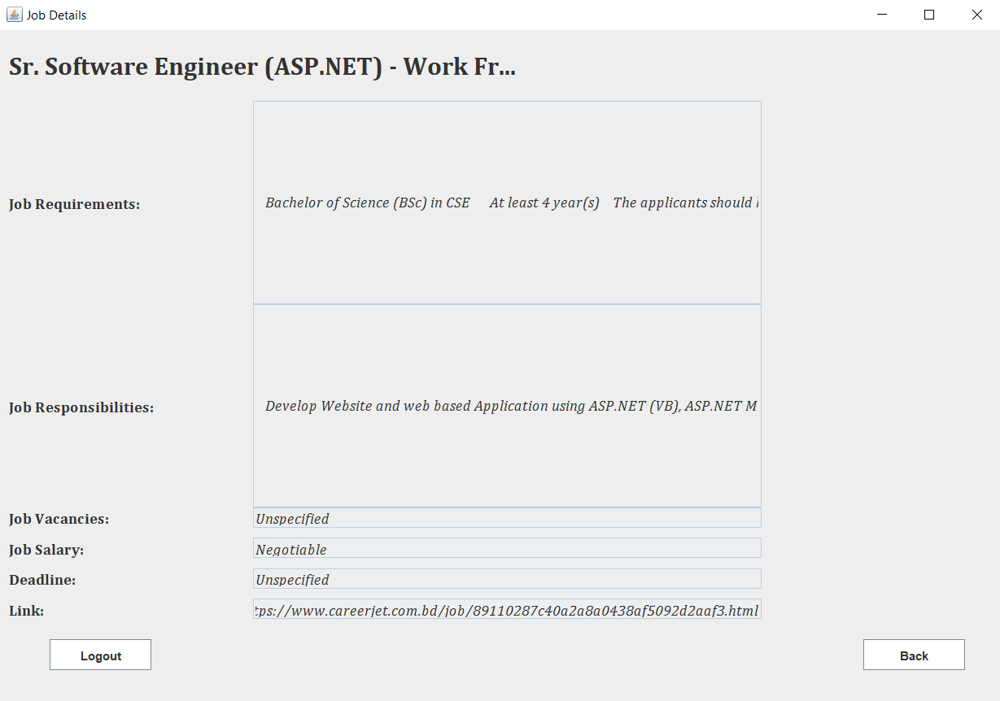

# Local IT Job Finder
## Introduction
Desktop based Web scraping & parsing application built on JavaSE to fetch IT job circulars from various Bangladeshi online job portals. It collects IT Job circulars from job portal and store them in local database and provides features to search and view according to user's need.

## Job Portals

* [CareerJet](http://www.careerjet.com.bd)
* [Job Dot Com](https://www.job.com.bd/)
* [BD Jobs](https://www.bdjobs.com/) - (Under development)


## Technologies

* JavaSE
* JSoup
* Swing
* MySQL

## Instruction

* Clone this repo: 
```
git clone https://github.com/SazzadSH/Local-IT-Job-Finder
```
* Import the MySQL DB from 'Database' folder
* Make sure handle dependecies: JDBC Driver, Java MySQL Connector, JSoup
* Build the application:
```
javac Start.java
java Start
```

## Screenshots








